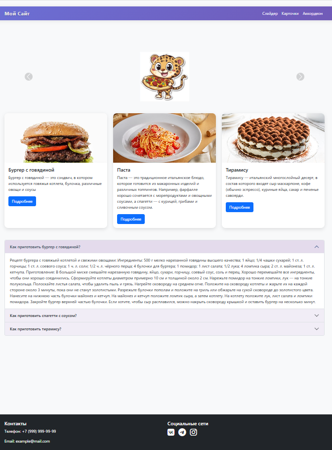

# VD-03_Bootstrap-5
# Кулинарный сайт "Мой Сайт"



## Описание
Веб-сайт с рецептами и кулинарными идеями, включающий:
- Карусель с тематическими изображениями
- Карточки популярных блюд
- Подробные рецепты в аккордеоне
- Контактную информацию и социальные сети

## Особенности
✅ Адаптивный дизайн для всех устройств  
✅ Интерактивные элементы: слайдер, карточки, аккордеон  
✅ Современный дизайн с анимациями  
✅ Оптимизированная структура кода  

## Технологии
- **HTML5**
- **CSS3** (кастомные стили + Bootstrap)
- **Bootstrap 5.3.3**
- **Font Awesome 6.4.0**

## Установка
1. Клонировать репозиторий:
```bash
git clone https://github.com/ваш-логин/репозиторий.git
Открыть в браузере:

bash
cd ваш-сайт && open index.html
Структура проекта
ваш-сайт/
├── index.html
├── css/
│   └── styles.css          # Глобальные стили
├── js/
│   └── scripts.js          # Пользовательские скрипты
└── img/                    # Изображения
    ├── тигренок с пиццей.png
    ├── Бургер с говядиной.jpg
    ├── Паста.jpg
    └── Тирамису.jpg
Использование
Навигация по разделам через меню

Просмотр изображений в слайдере

Изучение рецептов в аккордеоне

Переход по социальным сетям в футере

Лицензия
MIT License. Свободное использование и модификация кода.

Автор
[Георгий Дробенюк] - разработка и дизайн

✨ Совет: Для запуска проекта достаточно открыть index.html в любом современном браузере!